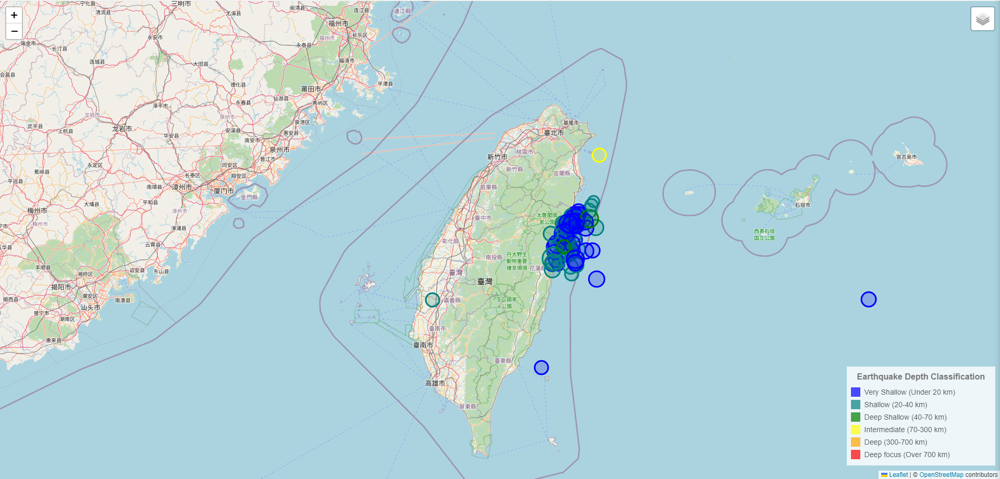

# Earthquake Data Map

The github page is available here: https://zhou0366.github.io/leaflet_challenge/
 
This page will create a map of recorded earthquakes mapped as circles on a map at their latitude and longitude. The base map will be OpenStreetMap and earthquake data will be retrieved from USGS. These circles will be color-coded by the recorded depth and the radius will be determined by magnitude as shown in the image below. The earthquake depths will be broken up generally according to the USGS depth classifications. Since most of the past 30 days of data earthquakes fall within the "Shallow" category, earthquakes in that range are further broken down into three depth categories. The map will be centered around Taiwan and the screenshot below was taken on April 10, 2024.

## Sources

OpenStreetMap

https://www.openstreetmap.org/copyright

USGS

http://earthquake.usgs.gov/earthquakes/feed/v1.0/geojson.php

Tool for creating and previewing a map legend 

https://codepen.io/haakseth/pen/KQbjdO

Two other examples I found on creating a map legend

https://gis.stackexchange.com/questions/133630/adding-leaflet-legend

https://leafletjs.com/examples/choropleth/

Earthquake depth classification based on https://www.usgs.gov/programs/earthquake-hazards/determining-depth-earthquake#:~:text=Shallow%20earthquakes%20are%20between%200,earthquakes%20deeper%20than%2070%20km.
